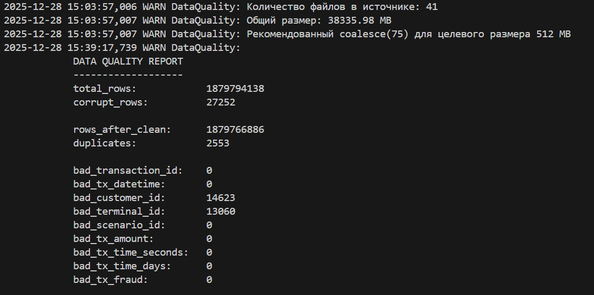
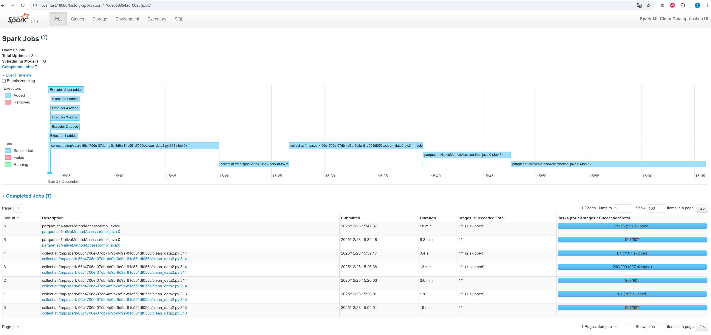
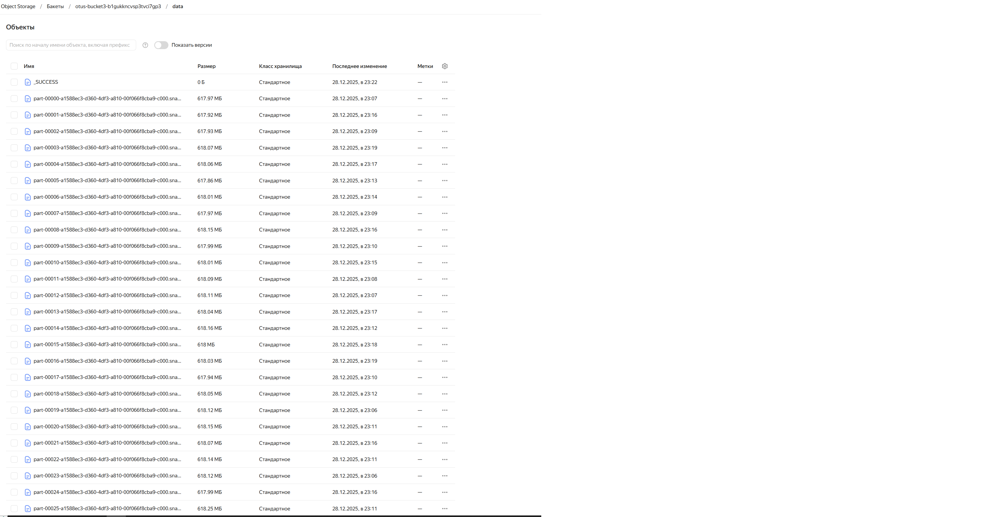

# mlops_2025_3
1,2,3  Сервисный аккаунт, кластер и новый bucket развернуты.

4 Проанализирован датасет (сначала брал 1 файл, на нём  знакомился с датасетом (notebooks/EDA_fraud_dataset.ipynb),
    позже null и describe посмотрел и на всём кластере (EDA_fraud_dataset_cl.ipynb), остальное - долго и в общем то и не сильно нужно. 
    
    Итого, выводы по обработке:
        transaction_id    int :  удаляем дубли; int,>=0; delete row
        tx_datetime       string :  заменяем "24:00:00" -> "23:59:59"; try_cast('timestamp'); delete row ? 
        customer_id	      int :  int,>=0;  определяем в новый id (например -1)
        terminal_id       int :  int,>=0;  определяем в новый id (например -1)
        tx_amount	      double: notnull,>=0; delete row 
        tx_time_seconds   int :  int,>=0; определяем в новый id (например -1)
        tx_time_days	  int :  int,>=0; определяем в новый id (например -1)
        tx_fraud	      bool :  int,in [0,1];  delete row
        tx_fraud_scenario int :  int,>=0;  определяем в новый id (например -1)

5 Скрипт очистки (clean_data2.py). 

    При считывании проблемные записи отмечаются в отдельное поле, 
    У части полей некорректные значения заменяются на спец. заполнитель (-1), так как в них наблюдался фрод (чтоб не потерять)
    По части полей, записи с некорректными значениями удаляются.

    Сделано логирование, но из за него требуется дополнительные операции, которые значительно увеличивают время обработки.

    Так же при запуске скрипта отрабатывает функция, вычисляющая количество файлов паркета исходя из текущего датасета и требуемого размера выходных файлов (указал 512Mb)

    При развертывании terraform скрипт загружается в новый bucket
    
    Запускал так:
        spark-submit s3a://otus-bucket3-b1gukkncvsp3tvci7gp3/scpts/clean_data2.py \
        --hdfs-path hdfs:///user/ubuntu/data \
        --s3-bucket-path s3a://otus-bucket3-b1gukkncvsp3tvci7gp3/data \
        --log-stats
    
        соответственно паркет запсиывается в 3a://otus-bucket3-b1gukkncvsp3tvci7gp3/data

6 Запускал скрипт на кластере: s3-c4-m16 + 3 х s3-c8-m32. 
    Лог очистки:

    то есть удалено 27252 + 2553 =  29805 строк ,
    оставлены со спец значнеием (-1) 14623 некорректных customer_id и 13060 некорректных terminal_id 
    (проверил на новом датасете - количество удаленных сходится)

    Очищеный датасет:
        s3a://otus-bucket3-b1gukkncvsp3tvci7gp3/data
        
    

PS. Думаю, так как количество отфильтрованных записей относительно небольшое, можно было бы сразу удалять некорректные данные, тогда работало бы сильно быстрее, не потребовалось бы persist.
Наверное хорошо бы эти данные записать в отдельную папку и там уже отдельно анализировать, но это уже на потом :)

